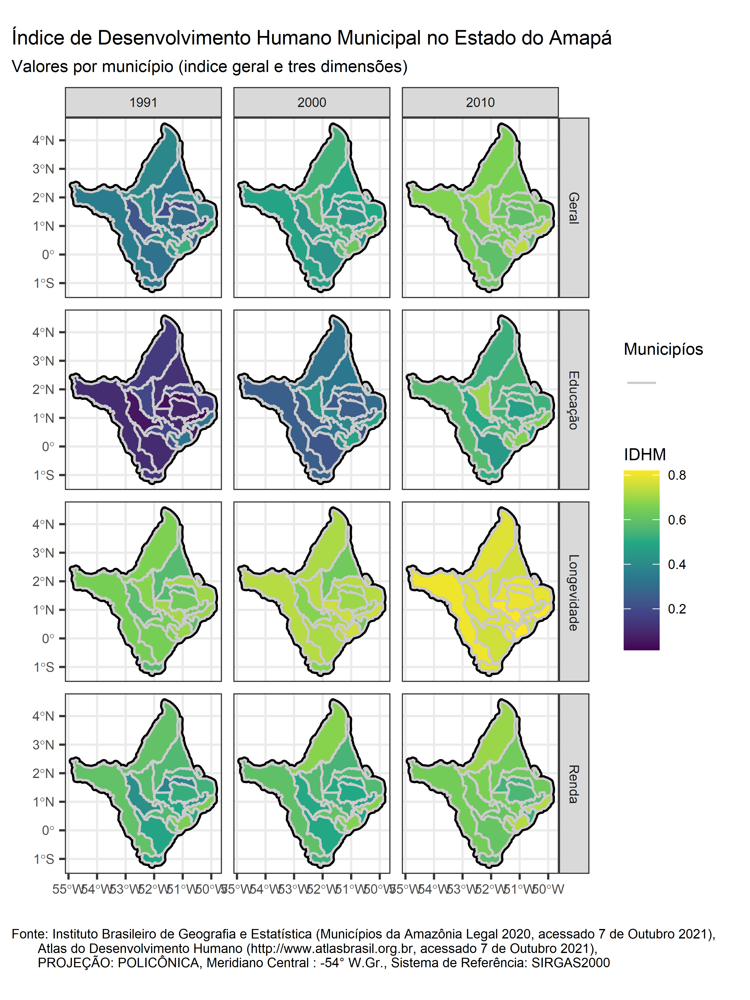

# ZEEAmapá

Zoneamento Ecológico-Econômico do Estado do Amapá ([ZEE/AP](http://www.zee.ap.gov.br/)). Projeto: Demografia, Arranjos Produtivos Locais, Índices e Indicadores Econômicos

Metrics and indicators describing demography, local productive systems and economics in the Brazilian state of Amapá ([ZEE/AP](http://www.zee.ap.gov.br/)).

## Conteúdo
Os dados aqui apresentados (gráficos, mapas) representam conteúdo do domínio público, disponibilizados pelos institutos, órgãos e entidades federais, estaduais e privados ([IBGE](https://www.ibge.gov.br/),  [Atlas do Desenvolvimento Humano](http://www.atlasbrasil.org.br) ). O conteúdo está aqui apresentado para divulgação ampla, respetiando as obrigações de transparência, assim para agilizar e facilitar o desenvolvimento técnico científco. O conteúdo não representar versões ou produtos  finais e não devem ser apresentados/relatados/compartilhados/interpretados como conclusivos. 

## Mapas
Índice de Desenvolvimento Humano Municipal no Estado do Amapá
(imagem de alta qualidade aqui: [IDHM/AP](https://github.com/darrennorris/ZEEAmapa/blob/main/images/AP_mapa_IDHM.tif) )

