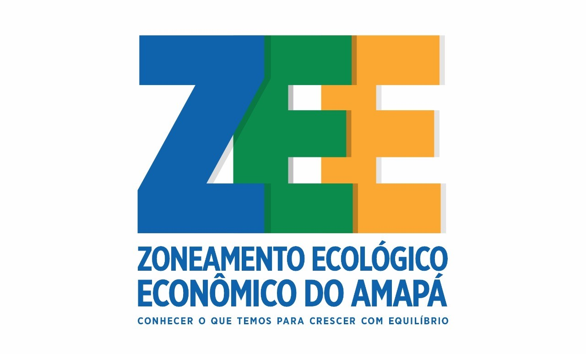

# ZEEAmapa

Metrics and indicators describing demography, local productive systems and economics in the Brazilian state of Amapá.

Zoneamento Ecológico-Econômico do Estado do Amapá ([ZEE/AP](http://www.zee.ap.gov.br/)). Projeto: Demografia, Arranjos Produtivos Locais, Índices e Indicadores Econômicos

