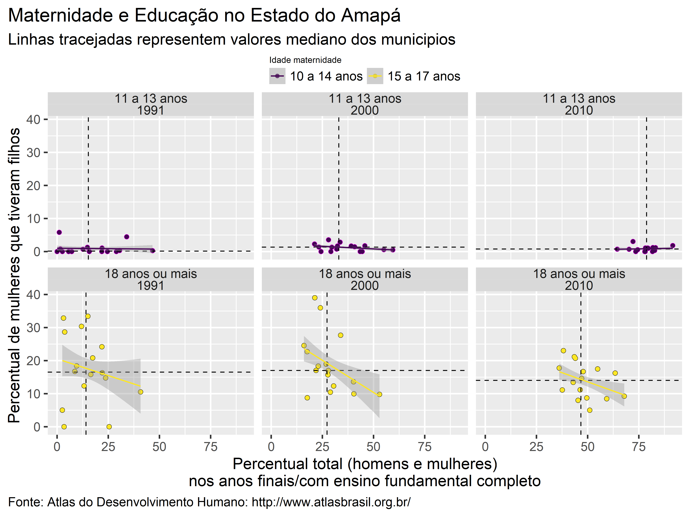
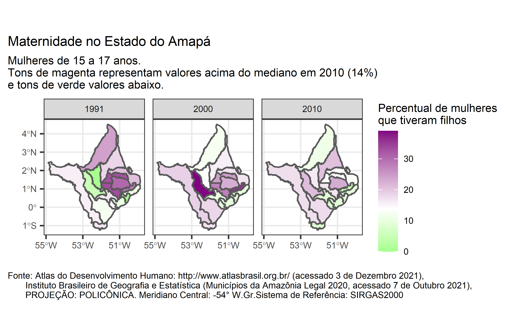

# Amapa-socioeco

Código de [R](https://cran.r-project.org/) e dados para o mapeamento de variáveis socioeconômicas no estado do Amapá.

[![CC BY-NC-SA 4.0][cc-by-nc-sa-image]][cc-by-nc-sa]  [![CC BY-NC-SA 4.0][cc-by-nc-sa-shield]][cc-by-nc-sa] This work is licensed under a
[Creative Commons Attribution-NonCommercial-ShareAlike 4.0 International License][cc-by-nc-sa].

[cc-by-nc-sa]: http://creativecommons.org/licenses/by-nc-sa/4.0/
[cc-by-nc-sa-image]: https://licensebuttons.net/l/by-nc-sa/4.0/88x31.png
[cc-by-nc-sa-shield]: https://img.shields.io/badge/License-CC%20BY--NC--SA%204.0-lightgrey.svg

## Conteúdo
Os dados aqui apresentados (gráficos, mapas) representam conteúdo do domínio público, disponibilizados pelos institutos, órgãos e entidades federais, estaduais e privados ([IBGE](https://www.ibge.gov.br/),  [Atlas do Desenvolvimento Humano](http://www.atlasbrasil.org.br), [Atlas da Vulnerabilidade Social](http://ivs.ipea.gov.br/index.php/pt/planilha), [PNUD](https://www.br.undp.org/content/brazil/pt/home/our-focus.html), [EMBRAPA](http://geoinfo.cnps.embrapa.br/), [Agência Nacional de Mineração](https://dados.gov.br/dataset/sistema-de-informacoes-geograficas-da-mineracao-sigmine) ). O conteúdo está aqui apresentado para divulgação ampla, respetiando as obrigações de transparência, assim para agilizar e facilitar o desenvolvimento técnico científco. O conteúdo não representar versões ou produtos  finais e não devem ser apresentados/relatados/compartilhados/interpretados como conclusivos. 

Os mapas e cartogramas ficam na pasta [figures](https://github.com/darrennorris/ZEEAmapa/tree/main/figures) (formato .png e .tif), dados geoespaciais na pasta [vector](https://github.com/darrennorris/ZEEAmapa/tree/main/vector) (formato shapefile e GPKG) e dados tabulados na pasta [dados](https://github.com/darrennorris/ZEEAmapa/tree/main/dados) (copia de dados disponibilisados pela [abjData](https://github.com/abjur/abjData), definicão de siglas etc) .

- [Mapas](#mapas)
  * [Desenvolvimento e Vulnerabilidade](#desenvolvimento-e-vulnerabilidade)
  * [Educação e maternidade](#educacao)
- [Mineração](#mineracao)

## Mapas
### Desenvolvimento e Vulnerabilidade
Índice de Desenvolvimento Humano Municipal no Estado do Amapá
(imagem de alta qualidade aqui: [IDHM/AP](https://github.com/darrennorris/ZEEAmapa/blob/main/figures/AP_mapa_IDHM.tif) )

Para entender melhor os valores do IDHM apresentados e também para facilitar o diálogo entre pessoas, poderes e institutos é possível verificar quais são as variáveis socioeconômicas mais importantes para as mudanças durante os últimos 30 anos.

Um diagnóstico com base em modelos lineares mostra que ações para reduzir pobreza, reduzir desigualdade e melhorar educação são os mais relevantes para melhorar o desenvolvimento humano no estado do Amapá. 

Especificamente, para acelerar o desenvolvimento humano no estado do Amapá, ações devem melhorar o percentual de 11-13 anos com ensino fundamental completo e a renda dos 60% mais pobres.  
(imagem de alta qualidade aqui: [variáveis importantes ](https://github.com/darrennorris/ZEEAmapa/blob/main/figures/AP_fig_impvars.tif) )

Variáveis socioeconômicas são freqüentemente correlacionadas, portanto, ao focar em apenas duas, é provável que as mudanças também melhorem outras variáveis. A tabela abaixo mostra as 29 variáveis associadas (fortemente correlacionadas) com as duas variáveis identificadas (percentual de 11-13 anos com ensino fundamental completo e a renda dos 60% mais pobres).

<table>
<tr><th>Renda dos 60% mais pobres </th><th>Percentual de 11-13 anos com   ensino fundamental completo </th></tr>
<tr><td>

|  correlação  |  variável                                                  |
|--------------|--------------------------------------------------------|
|  0.96        |  Percentual da renda apropriada   pelos 80% mais pobres  |
|  0.95        |  Percentual da renda apropriada   pelos 40% mais pobres  |
|  0.82        |  Percentual da renda apropriada   pelos 20% mais pobres  |

</td><td>

|  correlação  |  variável                                                                          |
|--------------|--------------------------------------------------------------------------------|
|  0.99        |  % de 12 a 14 anos nos anos finais do fundamental   ou com fundamental completo  |
|  0.94        |  % de 15 a 17 anos com fundamental completo                                    |
|  0.94        |  % de 18 a 24 anos com fundamental completo                                    |
|  0.93        |  % de 18 anos ou mais com fundamental completo                                 |
|  0.92        |  Taxa de frequência líquida ao médio                                           |
|  0.92        |  % de 16 a 18 anos com fundamental completo                                    |
|  0.92        |  % da população em domicílios com água encanada                                |
|  0.91        |  % de 6 a 17 anos no básico sem atraso                                         |
|  0.91        |  % de 6 a 14 anos no fundamental sem atraso                                    |
|  0.91        |  % de 25 anos ou mais com fundamental completo                                 |
|  0.89        |  Probabilidade de sobrevivência até 40 anos                                    |
|  0.89        |  % de 18 anos ou mais com médio completo                                       |
|  0.88        |  Probabilidade de sobrevivência até 60 anos                                    |
|  0.88        |  % de 18 a 20 anos com médio completo                                          |
|  0.88        |  % de 25 anos ou mais com médio completo                                       |
|  0.87        |  Esperança de vida ao nascer                                                   |
|  0.87        |  % de 18 a 24 anos com médio completo                                          |
|  0.85        |  % de 19 a 21 anos com médio completo                                          |
|  0.84        |  Taxa de frequência bruta ao médio                                             |
|  0.83        |  Taxa de frequência bruta ao superior                                          |
|  0.82        |  Taxa de frequência líquida ao básico                                          |
|  0.82        |  % de 5 a 6 anos na escola                                                     |
|  0.81        |  Taxa de frequência bruta ao básico                                            |
|  0.81        |  % da população em domicílios com banheiro   e água encanada                     |
</td></tr> </table>

### Educação e maternidade

Um primeiro passo importante para melhorar (aumentar) o percentual de 11-13 anos com ensino fundamental completo (e portanto melhorar educação no estado) seria aumentar a porcentagem de mulheres concluindo ensino fundamental.

Variáveis socioeconômicas não existem em isolação, e com base nos dados globais mostrando a importância de educação ([Hans Rosling Religion and babies](https://www.ted.com/talks/hans_rosling_religions_and_babies/transcript?language=en)), podemos olhar as mudanças entre 1991 e 2010 de educação e maternidade em mulheres mais jovens ([WHO](https://www.who.int/news-room/fact-sheets/detail/adolescent-pregnancy), [febrasgo Gravidez na adolescencia](https://www.febrasgo.org.br/pt/noticias/item/1210-reflexoes-sobre-a-semana-nacional-de-prevencao-da-gravidez-na-adolescencia-2021)). Conforme a educação avançava, houve uma redução na % de maternidade em mulheres mais jovens (redução no % mediano e na variação nos valores entre municípios), e portanto, com avanços na educação, esperamos uma redução expressiva na desigualdade entre os sexos .......

(imagem de alta qualidade aqui: [maternidade/AP](https://github.com/darrennorris/ZEEAmapa/blob/main/figures/AP_fig_muledu.tif) )

Olhando a dsitribuição entre municipios tambem mostra uma redução no % mediano e na variação nos valores entre municípios.

(imagem de alta qualidade aqui: [mapa/maternidade/AP](https://github.com/darrennorris/ZEEAmapa/blob/main/figures/AP_mapa_maternidade_15a17.tif) )

Uma comparação com o valor mediano de 2010 mostra que havia 10 municípios com um percentual de mulheres entre 15 e 17 anos acima do mediano (Calçoene, Ferreira Gomes, Laranjal do Jari, Mazagão, Pedra Branca do Amapari, 
Pracuúba, Serra do Navio, Tartarugalzinho). Com percentuais mais elevados em TARTARUGALZINHO (23,0%), PEDRA BRANCA DO AMAPARI (21.2%) e Calçoene (20,7%).

(imagem de alta qualidade aqui: [mapa/maternidade/AP](https://github.com/darrennorris/ZEEAmapa/blob/main/figures/AP_mapa_maternidade_mediano_15a17.tif) )

## Mineração
Espera-se que as tensões entre mineração e desenvolvimento sustentável se intensificam à medida que as populações humanas crescem e as tecnologias avançam. No entanto, a mineração também pode ser um meio de financiar caminhos alternativos de desenvolvimento que, a longo prazo, podem trazer verios beneficios ([DDSM](https://www.gov.br/mme/pt-br/assuntos/secretarias/geologia-mineracao-e-transformacao-mineral/desenvolvimento-sustentavel-na-mineracao-1), [IISD](https://www.iisd.org/articles/how-advance-sustainable-mining)).

Mineração a escala industrial iniciou na década de 1950 no Estado do Amapá. Depois de mais de 70 anos, um relatorio recente ([Costa 2019](http://ageamapa.ap.gov.br/docs/investinamapa/Plano-de-Mineracao.pdf)) demonstra que a exportação de bens minerais ainda é o principal gerador de receitas na balança comercial amapaense, representando aproximadamente 65% de tudo que foi exportado pelo estado em 2018 (cerca de 150 milhões de dólares (US$)).

A arrecadação atraves Compensação Financeira pela Exploração de Recursos Minerais ([CFEM](https://sistemas.anm.gov.br/arrecadacao/extra/relatorios/arrecadacao_cfem.aspx)) gerar recursos finaceiros (para os estados e municipios) destinadas a reparar os danos causados nas áreas de exploração mineral.

(imagem de alta qualidade aqui: [CFEM/AP](https://github.com/darrennorris/Amapa-socioeco/blob/main/figures/AP_fig_cfem.tif) )

Dois municípios no estado (Vitória do Jari e Pedra Branca do Amapari) representam os municípios com as maiores receitas de CFEM entre 2004 e 2021.

(imagem de alta qualidade aqui: [CFEM/MAPA/AP](https://github.com/darrennorris/Amapa-socioeco/blob/main/figures/AP_mapa_cfem.tif) )

